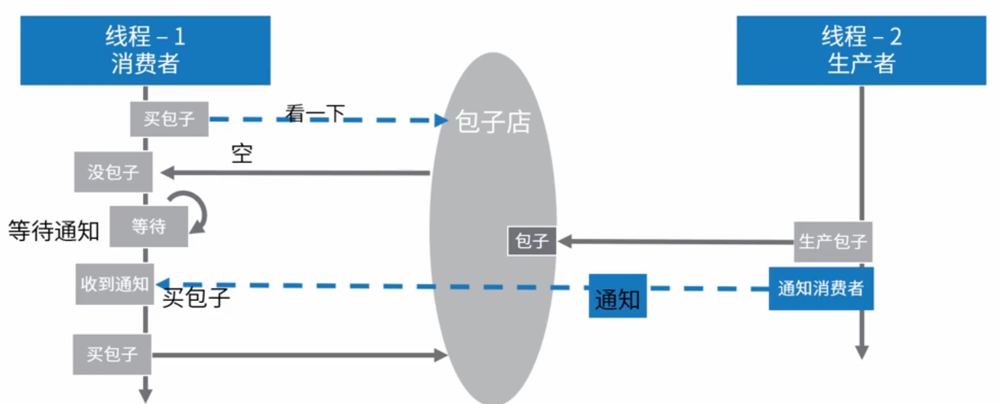

# 线程通信

要想实现多个线程之间的通信
如： 线程执行的先后顺序、获取某个线程执行的结果等。

涉及到线程之间的相互通信/协作，分为 四类：

1. 文件共享

2. 网络共享

3. 共享变量

4. JDK 提供的线程协同 API 
   1. suppend/resume  (已经弃用)
   2. wait/notify
   3. park/unpark

5. 管道通信


## 共享变量代码示例

```
package com.study.hc.thread.chapter1.thread;

public class MainTest {
  // 共享变量
  public static String content = "空";
  
  public static void main(String[] args) {
    // 线程1 - 写入数据
    new Thread(() -> {
      try {
        while (true) {
          content = "当前时间" + String.valueOf(System.currentTimeMillis());
          Thread.sleep(1000L);
        }
      } catch (Exception e) {
        e.printStackTrace();
      }
    }).start();

    // 线程2 - 读取数据
    new Thread(() -> {
      try {
        while (true) {
          Thread.sleep(1000L);
          System.out.println(content);
        }
      } catch (Exception e) {
        e.printStackTrace();
      }
    }).start();
  }
}

```
### JDK 提供的线程协同 API 代码分析：


JDK 中对于需要多线程协作完成某一任务的场景，提供了对应的 API 支持。多线程协作的典型场景是：生产者-消费者模型。（线程阻塞、线程唤醒）。

示例：线程-1 去买包子，没有包子，则不再执行。线程-2 生产包子，通知线程继续执行。




### suspend/resume

```
public class Demo6 {
	/** 包子店 */
	public static Object baozidian = null;

	/** 正常的suspend/resume */
	public void suspendResumeTest() throws Exception {
		// 启动线程
		Thread consumerThread = new Thread(() -> {
			if (baozidian == null) { // 如果没包子，则进入等待
				System.out.println("1、进入等待");
				Thread.currentThread().suspend();
			}
			System.out.println("2、买到包子，回家");
		});
		consumerThread.start();
		// 3秒之后，生产一个包子
		Thread.sleep(3000L);
		baozidian = new Object();
		consumerThread.resume();
		System.out.println("3、通知消费者");
	}

	/** 死锁的suspend/resume。 suspend并不会像wait一样释放锁，故此容易写出死锁代码 */
	public void suspendResumeDeadLockTest() throws Exception {
		// 启动线程
		Thread consumerThread = new Thread(() -> {
			if (baozidian == null) { // 如果没包子，则进入等待
				System.out.println("1、进入等待");
				// 当前线程拿到锁，然后挂起
				synchronized (this) {
					Thread.currentThread().suspend();
				}
			}
			System.out.println("2、买到包子，回家");
		});
		consumerThread.start();
		// 3秒之后，生产一个包子
		Thread.sleep(3000L);
		baozidian = new Object();
		// 争取到锁以后，再恢复consumerThread
		synchronized (this) {
			consumerThread.resume();
		}
		System.out.println("3、通知消费者");
	}

	/** 导致程序永久挂起的suspend/resume */
	public void suspendResumeDeadLockTest2() throws Exception {
		// 启动线程
		Thread consumerThread = new Thread(() -> {
			if (baozidian == null) {
				System.out.println("1、没包子，进入等待");
				try { // 为这个线程加上一点延时
					Thread.sleep(5000L);
				} catch (InterruptedException e) {
					e.printStackTrace();
				}
				// 这里的挂起执行在resume后面
				Thread.currentThread().suspend();
			}
			System.out.println("2、买到包子，回家");
		});
		consumerThread.start();
		// 3秒之后，生产一个包子
		Thread.sleep(3000L);
		baozidian = new Object();
		consumerThread.resume();
		System.out.println("3、通知消费者");
		consumerThread.join();
	}
}
}

```
### notify/wait

```

/** 正常的wait/notify */
	public void waitNotifyTest() throws Exception {
		// 启动线程
		new Thread(() -> {
				synchronized (this) {
					while (baozidian == null) { // 如果没包子，则进入等待
					try {
						System.out.println("1、进入等待");
						this.wait();
					} catch (InterruptedException e) {
						e.printStackTrace();
					}
				}
			}
			System.out.println("2、买到包子，回家");
		}).start();
		// 3秒之后，生产一个包子
		Thread.sleep(3000L);
		baozidian = new Object();
		synchronized (this) {
			this.notifyAll();
			System.out.println("3、通知消费者");
		}
	}

	/** 会导致程序永久等待的wait/notify */
	public void waitNotifyDeadLockTest() throws Exception {
		// 启动线程
		new Thread(() -> {
			if (baozidian == null) { // 如果没包子，则进入等待
				try {
					Thread.sleep(5000L);
				} catch (InterruptedException e1) {
					e1.printStackTrace();
				}
				synchronized (this) {
					try {
						System.out.println("1、进入等待");
						this.wait();
					} catch (InterruptedException e) {
						e.printStackTrace();
					}
				}
			}
			System.out.println("2、买到包子，回家");
		}).start();
		// 3秒之后，生产一个包子
		Thread.sleep(3000L);
		baozidian = new Object();
		synchronized (this) {
			this.notifyAll();
			System.out.println("3、通知消费者");
		}
	}

```

### park/unpark
```
/** 正常的park/unpark */
	public void parkUnparkTest() throws Exception {
		// 启动线程
		Thread consumerThread = new Thread(() -> {
			while (baozidian == null) { // 如果没包子，则进入等待
				System.out.println("1、进入等待");
				LockSupport.park();
			}
			System.out.println("2、买到包子，回家");
		});
		consumerThread.start();
		// 3秒之后，生产一个包子
		Thread.sleep(3000L);
		baozidian = new Object();
		LockSupport.unpark(consumerThread);
		System.out.println("3、通知消费者");
	}

	/** 死锁的park/unpark */
	public void parkUnparkDeadLockTest() throws Exception {
		// 启动线程
		Thread consumerThread = new Thread(() -> {
			if (baozidian == null) { // 如果没包子，则进入等待
				System.out.println("1、进入等待");
				// 当前线程拿到锁，然后挂起
				synchronized (this) {
					LockSupport.park();
				}
			}
			System.out.println("2、买到包子，回家");
		});
		consumerThread.start();
		// 3秒之后，生产一个包子
		Thread.sleep(3000L);
		baozidian = new Object();
		// 争取到锁以后，再恢复consumerThread
		synchronized (this) {
			LockSupport.unpark(consumerThread);
		}
		System.out.println("3、通知消费者");
	}

```

### 所有代码

```
package com.study.hc.thread.chapter1.thread;

import java.util.concurrent.locks.LockSupport;

/** 三种线程协作通信的方式：suspend/resume、wait/notify、park/unpark */
public class Demo6 {
	/** 包子店 */
	public static Object baozidian = null;

	/** 正常的suspend/resume */
	public void suspendResumeTest() throws Exception {
		// 启动线程
		Thread consumerThread = new Thread(() -> {
			if (baozidian == null) { // 如果没包子，则进入等待
				System.out.println("1、进入等待");
				Thread.currentThread().suspend();
			}
			System.out.println("2、买到包子，回家");
		});
		consumerThread.start();
		// 3秒之后，生产一个包子
		Thread.sleep(3000L);
		baozidian = new Object();
		consumerThread.resume();
		System.out.println("3、通知消费者");
	}

	/** 死锁的suspend/resume。 suspend并不会像wait一样释放锁，故此容易写出死锁代码 */
	public void suspendResumeDeadLockTest() throws Exception {
		// 启动线程
		Thread consumerThread = new Thread(() -> {
			if (baozidian == null) { // 如果没包子，则进入等待
				System.out.println("1、进入等待");
				// 当前线程拿到锁，然后挂起
				synchronized (this) {
					Thread.currentThread().suspend();
				}
			}
			System.out.println("2、买到包子，回家");
		});
		consumerThread.start();
		// 3秒之后，生产一个包子
		Thread.sleep(3000L);
		baozidian = new Object();
		// 争取到锁以后，再恢复consumerThread
		synchronized (this) {
			consumerThread.resume();
		}
		System.out.println("3、通知消费者");
	}

	/** 导致程序永久挂起的suspend/resume */
	public void suspendResumeDeadLockTest2() throws Exception {
		// 启动线程
		Thread consumerThread = new Thread(() -> {
			if (baozidian == null) {
				System.out.println("1、没包子，进入等待");
				try { // 为这个线程加上一点延时
					Thread.sleep(5000L);
				} catch (InterruptedException e) {
					e.printStackTrace();
				}
				// 这里的挂起执行在resume后面
				Thread.currentThread().suspend();
			}
			System.out.println("2、买到包子，回家");
		});
		consumerThread.start();
		// 3秒之后，生产一个包子
		Thread.sleep(3000L);
		baozidian = new Object();
		consumerThread.resume();
		System.out.println("3、通知消费者");
		consumerThread.join();
	}

	/** 正常的wait/notify */
	public void waitNotifyTest() throws Exception {
		// 启动线程
		new Thread(() -> {
				synchronized (this) {
					while (baozidian == null) { // 如果没包子，则进入等待
					try {
						System.out.println("1、进入等待");
						this.wait();
					} catch (InterruptedException e) {
						e.printStackTrace();
					}
				}
			}
			System.out.println("2、买到包子，回家");
		}).start();
		// 3秒之后，生产一个包子
		Thread.sleep(3000L);
		baozidian = new Object();
		synchronized (this) {
			this.notifyAll();
			System.out.println("3、通知消费者");
		}
	}

	/** 会导致程序永久等待的wait/notify */
	public void waitNotifyDeadLockTest() throws Exception {
		// 启动线程
		new Thread(() -> {
			if (baozidian == null) { // 如果没包子，则进入等待
				try {
					Thread.sleep(5000L);
				} catch (InterruptedException e1) {
					e1.printStackTrace();
				}
				synchronized (this) {
					try {
						System.out.println("1、进入等待");
						this.wait();
					} catch (InterruptedException e) {
						e.printStackTrace();
					}
				}
			}
			System.out.println("2、买到包子，回家");
		}).start();
		// 3秒之后，生产一个包子
		Thread.sleep(3000L);
		baozidian = new Object();
		synchronized (this) {
			this.notifyAll();
			System.out.println("3、通知消费者");
		}
	}

	/** 正常的park/unpark */
	public void parkUnparkTest() throws Exception {
		// 启动线程
		Thread consumerThread = new Thread(() -> {
			while (baozidian == null) { // 如果没包子，则进入等待
				System.out.println("1、进入等待");
				LockSupport.park();
			}
			System.out.println("2、买到包子，回家");
		});
		consumerThread.start();
		// 3秒之后，生产一个包子
		Thread.sleep(3000L);
		baozidian = new Object();
		LockSupport.unpark(consumerThread);
		System.out.println("3、通知消费者");
	}

	/** 死锁的park/unpark */
	public void parkUnparkDeadLockTest() throws Exception {
		// 启动线程
		Thread consumerThread = new Thread(() -> {
			if (baozidian == null) { // 如果没包子，则进入等待
				System.out.println("1、进入等待");
				// 当前线程拿到锁，然后挂起
				synchronized (this) {
					LockSupport.park();
				}
			}
			System.out.println("2、买到包子，回家");
		});
		consumerThread.start();
		// 3秒之后，生产一个包子
		Thread.sleep(3000L);
		baozidian = new Object();
		// 争取到锁以后，再恢复consumerThread
		synchronized (this) {
			LockSupport.unpark(consumerThread);
		}
		System.out.println("3、通知消费者");
	}

	public static void main(String[] args) throws Exception {
		// 对调用顺序有要求，也要开发自己注意锁的释放。这个被弃用的API， 容易死锁，也容易导致永久挂起。
//		 new Demo6().suspendResumeTest();
//		 new Demo6().suspendResumeDeadLockTest();
//		 new Demo6().suspendResumeDeadLockTest2();

		// wait/notify要求再同步关键字里面使用，免去了死锁的困扰，但是一定要先调用wait，再调用notify，否则永久等待了
		// new Demo6().waitNotifyTest();
//		 new Demo6().waitNotifyDeadLockTest();

		// park/unpark没有顺序要求，但是park并不会释放锁，所有再同步代码中使用要注意
//		 new Demo6().parkUnparkTest();
		 new Demo6().parkUnparkDeadLockTest();

	}
}
```

## 总结
1. **suspend 和 resume** 容易写出死锁代码所以被弃用，导致死锁的原因： suspend 挂起之后不会释放锁；suspend 和 resume 先后顺序不保证。
2. **wait 和 notify**。只能由同一对象锁的持有者线程调用，也就是说写在代码同步块里，否则会抛出 IllegalMonitorStateException 异常。wait 方法导致当前线程等待，加入该对象的等待集合中，并且 放弃当前持有的对象锁。notify 和 notifyAll 方法唤醒一个或所有正在等待这个对象锁的线程。
> 注意：虽然  wait 会自动解锁，但是对顺序有要求。 如果 wait 方法，是在 notify 之后调用，则线程会永远处于 waitting 状态。

3. **park / unpark** park 是等待许可，unpark 是为指定线程提供许可，对顺序没有要求，调用park时候，如果调用过 unpark 则，线程直接执行。但是unpark 的调用不会叠加，如果只要调一次park，则许可就会失效。后续调用park，则该线程会进入等待状态。
4. **伪唤醒** 由于jvm 在实现机制问题，通过以上三种方式会出现错误警报或伪唤醒的问题，这时并不是真正的满足条件唤醒。如果 通过 if 语句判断是否为空，来使线程进入等待状态，则会出现异常情况。所以建议 通过 while 循环，然后设置 flag来检测线程的等待条件。


