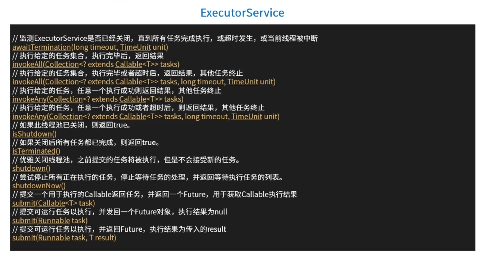

# 线程池


## 线程是不是越多越好？

1. 线程在 Java 中是一个对象，更是操作系统的资源，线程创建、销毁需要时间。如果创建时间+销毁时间 > 执行任务时间，这样就很不合算。
2. Java 对象占用堆内存，操作系统线程占用系统内存，根据 JVM 规范，一个线程默认最大栈大小为 1 M，这个栈空间是需要从系统内存中分配的。线程过多，会消耗很多的内存。
3. 操作系统需要频繁切换线程上下文（大家都想被运行），影响性能。

线程池的推出，就是为了方便控制线程数量。

## 线程池组成部分：
1. 线程池管理器：用于创建并管理线程池，包括创建线程池，销毁线程池，添加新任务。
2. 工作线程：线程池中线程，在没有任务时处于等待状态，可以循环的执行任务。
3. 任务接口（Runnable）: 每个任务必须实现接口，以供工作线程调度任务执行，它主要规定了任务的入口、任务执行完后的收尾工作、任务的执行状态等。
4. 任务队列：用于存放没有处理的任务。提供一种缓冲机制


## 线程池 API-接口定义和实现类


| 类型 | 名称 | 描述 |
| --- | --- | --- |
| 接口 |  Executor| 最上层的接口，定义了执行任务的方法 execute() |
| 接口 |  ExecutorService| 继承Executor 接口，拓展了 Callable、Future、关闭方法|
| 接口 |  ScheduledExecutorService| 继承ExecutorService 接口，增加了定时任务相关的方法|
|实现类 |  ThreadPoolExecutor| 基础、标准的线程池实现|
|实现类 |  ScheduledThreadPoolExecutor| 继承了 ThreadPoolExecutor，实现了 ScheduledExecutorService中相关定时任务的方法|

`ScheduledThreadPoolExecutor`是功能最为丰富的类。





## 线程池原理-任务 execute 过程

1. 是否达到核心线程数量？没达到，创建一个工作线程来执行任务。
2. 工作队列是否已满？没满，则将新提交的任务存储在工作队列里。
3. 是否达到线程池最大数量？没达到，则创建一个新的工作线程来执行任务。
4. 最后，执行拒绝策略来处理这个任务。


## 示例代码分析

测试： 提交15个执行时间需要3秒的任务，看超过大小的2个，对应的处理情况

```java
public void testCommon(ThreadPoolExecutor threadPoolExecutor) throws Exception {
		// 测试： 提交15个执行时间需要3秒的任务，看超过大小的2个，对应的处理情况
		for (int i = 0; i < 15; i++) {
			int n = i;
			threadPoolExecutor.submit(new Runnable() {
				@Override
				public void run() {
					try {
						System.out.println("开始执行：" + n);
						Thread.sleep(3000L);
						System.err.println("执行结束:" + n);
					} catch (InterruptedException e) {
						e.printStackTrace();
					}
				}
			});
			System.out.println("任务提交成功 :" + i);
		}
		// 查看线程数量，查看队列等待数量
		Thread.sleep(500L);
		System.out.println("当前线程池线程数量为：" + threadPoolExecutor.getPoolSize());
		System.out.println("当前线程池等待的数量为：" + threadPoolExecutor.getQueue().size());
		// 等待15秒，查看线程数量和队列数量（理论上，会被超出核心线程数量的线程自动销毁）
		Thread.sleep(15000L);
		System.out.println("当前线程池线程数量为：" + threadPoolExecutor.getPoolSize());
		System.out.println("当前线程池等待的数量为：" + threadPoolExecutor.getQueue().size());
	}

```

- 场景一：

> 线程池信息： 核心线程数量5，最大数量10，无界队列，超出核心线程数量的线程存活时间：5秒， 指定拒绝策略。

```java
private void threadPoolExecutorTest1() throws Exception {
		ThreadPoolExecutor threadPoolExecutor = new ThreadPoolExecutor(5, 10, 5, TimeUnit.SECONDS,
				new LinkedBlockingQueue<Runnable>());
		testCommon(threadPoolExecutor);
}

```

> 预计结果：线程池线程数量为：5,超出数量的任务，其他的进入队列中等待被执行

- 场景二：

>  线程池信息： 核心线程数量5，最大数量10，队列大小3，超出核心线程数量的线程存活时间：5秒， 指定拒绝策略.

```java
private void threadPoolExecutorTest2() throws Exception {
		// 创建一个 核心线程数量为5，最大数量为10,等待队列最大是3 的线程池，也就是最大容纳13个任务。
		// 默认的策略是抛出RejectedExecutionException异常，java.util.concurrent.ThreadPoolExecutor.AbortPolicy
		ThreadPoolExecutor threadPoolExecutor = new ThreadPoolExecutor(5, 10, 5, TimeUnit.SECONDS,
				new LinkedBlockingQueue<Runnable>(3), new RejectedExecutionHandler() {
					@Override
					public void rejectedExecution(Runnable r, ThreadPoolExecutor executor) {
						System.err.println("有任务被拒绝执行了");
					}
				});
		testCommon(threadPoolExecutor);
		
	}
```
>  预计结果：
1. 5个任务直接分配线程开始执行
2. 3个任务进入等待队列
3. 队列不够用，临时加开5个线程来执行任务(5秒没活干就销毁)
4. 队列和线程池都满了，剩下2个任务，没资源了，被拒绝执行。
5. 任务执行，5秒后，如果无任务可执行，销毁临时创建的5个线程

- 场景三：

> 线程池信息： 核心线程数量5，最大数量5，无界队列，超出核心线程数量的线程存活时间：5秒

```java
/**
 * 3、 线程池信息： 核心线程数量5，最大数量5，无界队列，超出核心线程数量的线程存活时间：5秒
 * 
 * @throws Exception
 */
private void threadPoolExecutorTest3() throws Exception {
		// 和Executors.newFixedThreadPool(int nThreads)一样的
		ThreadPoolExecutor threadPoolExecutor = new ThreadPoolExecutor(5, 5, 0L, TimeUnit.MILLISECONDS,
				new LinkedBlockingQueue<Runnable>());
		testCommon(threadPoolExecutor);
		// 
	}
```
> 预计结果：线程池线程数量为：5，超出数量的任务，其他的进入队列中等待被执行


- 场景四：

> 线程池信息：核心线程数量0，最大数量Integer.MAX_VALUE，SynchronousQueue队列，超出核心线程数量的线程存活时间：60秒

```java

private void threadPoolExecutorTest4() throws Exception {
		ThreadPoolExecutor threadPoolExecutor = new ThreadPoolExecutor(0, Integer.MAX_VALUE, 60L, TimeUnit.SECONDS,
				new SynchronousQueue<Runnable>());
		testCommon(threadPoolExecutor);
		Thread.sleep(60000L);
		System.out.println("60秒后，再看线程池中的数量：" + threadPoolExecutor.getPoolSize());
	}

```
> 预计结果：
> 1. 线程池线程数量为：15，超出数量的任务，其他的进入队列中等待被执行
> 2. 所有任务执行结束，60秒后，如果无任务可执行，所有线程全部被销毁，池的大小恢复为0

> SynchronousQueue，实际上它不是一个真正的队列，因为它不会为队列中元素维护存储空间。与其他队列不同的是，它维护一组线程，这些线程在等待着把元素加入或移出队列。
> 在使用SynchronousQueue作为工作队列的前提下，客户端代码向线程池提交任务时，
> 而线程池中又没有空闲的线程能够从SynchronousQueue队列实例中取一个任务，
> 那么相应的offer方法调用就会失败（即任务没有被存入工作队列）。
> 此时，ThreadPoolExecutor会新建一个新的工作者线程用于对这个入队列失败的任务进行处理（假设此时线程池的大小还未达到其最大线程池大小maximumPoolSize）。
> 和Executors.newCachedThreadPool()一样的

- 场景五：

> 定时执行线程池信息：3秒后执行，一次性任务，到点就执行 
> 核心线程数量5，最大数量Integer.MAX_VALUE，DelayedWorkQueue延时队列，超出核心线程数量的线程存活时间：0秒

```java
    private void threadPoolExecutorTest5() throws Exception {
        // 和Executors.newScheduledThreadPool()一样的
        ScheduledThreadPoolExecutor threadPoolExecutor = new ScheduledThreadPoolExecutor(5);
        threadPoolExecutor.schedule(new Runnable() {
            @Override
            public void run() {
                System.out.println("任务被执行，现在时间：" + System.currentTimeMillis());
            }
        }, 3000, TimeUnit.MILLISECONDS);
        System.out.println(
                "定时任务，提交成功，时间是：" + System.currentTimeMillis() + ", 当前线程池中线程数量：" + threadPoolExecutor.getPoolSize());
        
    }
```

> 预计结果：任务在3秒后被执行一次

- 场景六：

> 定时执行线程池信息：线程固定数量5 , 核心线程数量5，最大数量Integer.MAX_VALUE，DelayedWorkQueue延时队列，超出核心线程数量的线程存活时间：0秒

```java
private void threadPoolExecutorTest6() throws Exception {
        ScheduledThreadPoolExecutor threadPoolExecutor = new ScheduledThreadPoolExecutor(5);
        threadPoolExecutor.scheduleAtFixedRate(new Runnable() {
            @Override
            public void run() {
                try {
                    Thread.sleep(3000L);
                } catch (InterruptedException e) {
                    e.printStackTrace();
                }
                System.out.println("任务-1 被执行，现在时间：" + System.currentTimeMillis());
            }
        }, 2000, 1000, TimeUnit.MILLISECONDS);
        threadPoolExecutor.scheduleWithFixedDelay(new Runnable() {
            @Override
            public void run() {
                try {
                    Thread.sleep(3000L);
                } catch (InterruptedException e) {
                    e.printStackTrace();
                }
                System.out.println("任务-2 被执行，现在时间：" + System.currentTimeMillis());
            }
        }, 2000, 1000, TimeUnit.MILLISECONDS);
    }

```
> 周期性执行某一个任务，线程池提供了两种调度方式
> 
> 测试场景：提交的任务需要3秒才能执行完毕。看两种不同调度方式的区别
> 效果1： 提交后，2秒后开始第一次执行，之后每间隔1秒，固定执行一次(如果发现上次执行还未完毕，则等待完毕，完毕后立刻执行)。
 也就是说这个代码中是，3秒钟执行一次（计算方式：每次执行三秒，间隔时间1秒，执行结束后马上开始下一次执行，无需等待）
>
> 效果2： 提交后，2秒后开始第一次执行，之后每间隔1秒，固定执行一次(如果发现上次执行还未完毕，则等待完毕，等上一次执行完毕后再开始计时，等待1秒)。也就是说这个代码钟的效果看到的是：4秒执行一次。 （计算方式：每次执行3秒，间隔时间1秒，执行完以后再等待1秒，所以是 3+1）

## 线程终止

线程池信息： 核心线程数量5，最大数量10，队列大小3，超出核心线程数量的线程存活时间：5秒， 指定拒绝策略.

- shutdown()

创建一个 核心线程数量为5，最大数量为10,等待队列最大是3 的线程池，也就是最大容纳13个任务。
默认的策略是抛出RejectedExecutionException异常，java.util.concurrent.ThreadPoolExecutor.AbortPolicy

```java
private void threadPoolExecutorTest7() throws Exception {
        ThreadPoolExecutor threadPoolExecutor = new ThreadPoolExecutor(5, 10, 5, TimeUnit.SECONDS,
                new LinkedBlockingQueue<Runnable>(3), new RejectedExecutionHandler() {
                    @Override
                    public void rejectedExecution(Runnable r, ThreadPoolExecutor executor) {
                        System.err.println("有任务被拒绝执行了");
                    }
                });
        // 测试： 提交15个执行时间需要3秒的任务，看超过大小的2个，对应的处理情况
        for (int i = 0; i < 15; i++) {
            int n = i;
            threadPoolExecutor.submit(new Runnable() {
                @Override
                public void run() {
                    try {
                        System.out.println("开始执行：" + n);
                        Thread.sleep(3000L);
                        System.err.println("执行结束:" + n);
                    } catch (InterruptedException e) {
                        System.out.println("异常：" + e.getMessage());
                    }
                }
            });
            System.out.println("任务提交成功 :" + i);
        }
        // 1秒后终止线程池
        Thread.sleep(1000L);
        threadPoolExecutor.shutdown();
        // 再次提交提示失败
        threadPoolExecutor.submit(new Runnable() {
            @Override
            public void run() {
                System.out.println("追加一个任务");
            }
        });
        
    }
```
>  结果分析
> 1. 10个任务被执行，3个任务进入队列等待，2个任务被拒绝执行
> 2. 调用shutdown后，不接收新的任务，等待13任务执行结束
> 3. 追加的任务在线程池关闭后，无法再提交，会被拒绝执行

- shutdownNow()

创建一个 核心线程数量为5，最大数量为10,等待队列最大是3 的线程池，也就是最大容纳13个任务。默认的策略是抛出RejectedExecutionException异常，java.util.concurrent.ThreadPoolExecutor.AbortPolicy

```java
private void threadPoolExecutorTest8() throws Exception {

        ThreadPoolExecutor threadPoolExecutor = new ThreadPoolExecutor(5, 10, 5, TimeUnit.SECONDS,
                new LinkedBlockingQueue<Runnable>(3), new RejectedExecutionHandler() {
                    @Override
                    public void rejectedExecution(Runnable r, ThreadPoolExecutor executor) {
                        System.err.println("有任务被拒绝执行了");
                    }
                });
        // 测试： 提交15个执行时间需要3秒的任务，看超过大小的2个，对应的处理情况
        for (int i = 0; i < 15; i++) {
            int n = i;
            threadPoolExecutor.submit(new Runnable() {
                @Override
                public void run() {
                    try {
                        System.out.println("开始执行：" + n);
                        Thread.sleep(3000L);
                        System.err.println("执行结束:" + n);
                    } catch (InterruptedException e) {
                        System.out.println("异常：" + e.getMessage());
                    }
                }
            });
            System.out.println("任务提交成功 :" + i);
        }
        // 1秒后终止线程池
        Thread.sleep(1000L);
        List<Runnable> shutdownNow = threadPoolExecutor.shutdownNow();
        // 再次提交提示失败
        threadPoolExecutor.submit(new Runnable() {
            @Override
            public void run() {
                System.out.println("追加一个任务");
            }
        });
        System.out.println("未结束的任务有：" + shutdownNow.size());

        
    }
```
> 结果分析
> 1. 10个任务被执行，3个任务进入队列等待，2个任务被拒绝执行
> 2. 调用shutdownnow后，队列中的3个线程不再执行，10个线程被终止
> 3. 追加的任务在线程池关闭后，无法再提交，会被拒绝执行

## 最后线程数量的选择

- **计算型任务**： cpu 数量的 1-2 倍。
- **IO型任务**：相对比计算型任务，需多一些线程，要根据具体的 IO阻塞时长进行考量决定。
如 tomcat 中默认的最大线程数为：200

也可考虑根据需要在一个最小数量和最大数量间自动增减线程数。


以上测试完整代码：

```java

package com.study.hc.thread.chapter1.thread;

import java.util.Collections;
import java.util.List;
import java.util.concurrent.LinkedBlockingQueue;
import java.util.concurrent.RejectedExecutionHandler;
import java.util.concurrent.ScheduledThreadPoolExecutor;
import java.util.concurrent.SynchronousQueue;
import java.util.concurrent.ThreadPoolExecutor;
import java.util.concurrent.TimeUnit;

/** 线程池的使用 */
public class Demo9 {

	/**
	 * 测试： 提交15个执行时间需要3秒的任务,看线程池的状况
	 * 
	 * @param threadPoolExecutor 传入不同的线程池，看不同的结果
	 * @throws Exception
	 */
	public void testCommon(ThreadPoolExecutor threadPoolExecutor) throws Exception {
		// 测试： 提交15个执行时间需要3秒的任务，看超过大小的2个，对应的处理情况
		for (int i = 0; i < 15; i++) {
			int n = i;
			threadPoolExecutor.submit(new Runnable() {
				@Override
				public void run() {
					try {
						System.out.println("开始执行：" + n);
						Thread.sleep(3000L);
						System.err.println("执行结束:" + n);
					} catch (InterruptedException e) {
						e.printStackTrace();
					}
				}
			});
			System.out.println("任务提交成功 :" + i);
		}
		// 查看线程数量，查看队列等待数量
		Thread.sleep(500L);
		System.out.println("当前线程池线程数量为：" + threadPoolExecutor.getPoolSize());
		System.out.println("当前线程池等待的数量为：" + threadPoolExecutor.getQueue().size());
		// 等待15秒，查看线程数量和队列数量（理论上，会被超出核心线程数量的线程自动销毁）
		Thread.sleep(15000L);
		System.out.println("当前线程池线程数量为：" + threadPoolExecutor.getPoolSize());
		System.out.println("当前线程池等待的数量为：" + threadPoolExecutor.getQueue().size());
	}

	/**
	 * 1、线程池信息： 核心线程数量5，最大数量10，无界队列，超出核心线程数量的线程存活时间：5秒， 指定拒绝策略的
	 * 
	 * @throws Exception
	 */
	private void threadPoolExecutorTest1() throws Exception {
		ThreadPoolExecutor threadPoolExecutor = new ThreadPoolExecutor(5, 10, 5, TimeUnit.SECONDS,
				new LinkedBlockingQueue<Runnable>());
		testCommon(threadPoolExecutor);
		// 预计结果：线程池线程数量为：5,超出数量的任务，其他的进入队列中等待被执行
	}

	/**
	 * 2、 线程池信息： 核心线程数量5，最大数量10，队列大小3，超出核心线程数量的线程存活时间：5秒， 指定拒绝策略的
	 * 
	 * @throws Exception
	 */
	private void threadPoolExecutorTest2() throws Exception {
		// 创建一个 核心线程数量为5，最大数量为10,等待队列最大是3 的线程池，也就是最大容纳13个任务。
		// 默认的策略是抛出RejectedExecutionException异常，java.util.concurrent.ThreadPoolExecutor.AbortPolicy
		ThreadPoolExecutor threadPoolExecutor = new ThreadPoolExecutor(5, 10, 5, TimeUnit.SECONDS,
				new LinkedBlockingQueue<Runnable>(3), new RejectedExecutionHandler() {
					@Override
					public void rejectedExecution(Runnable r, ThreadPoolExecutor executor) {
						System.err.println("有任务被拒绝执行了");
					}
				});
		testCommon(threadPoolExecutor);
		// 预计结果：
		// 1、 5个任务直接分配线程开始执行
		// 2、 3个任务进入等待队列
		// 3、 队列不够用，临时加开5个线程来执行任务(5秒没活干就销毁)
		// 4、 队列和线程池都满了，剩下2个任务，没资源了，被拒绝执行。
		// 5、 任务执行，5秒后，如果无任务可执行，销毁临时创建的5个线程
	}

	/**
	 * 3、 线程池信息： 核心线程数量5，最大数量5，无界队列，超出核心线程数量的线程存活时间：5秒
	 * 
	 * @throws Exception
	 */
	private void threadPoolExecutorTest3() throws Exception {
		// 和Executors.newFixedThreadPool(int nThreads)一样的
		ThreadPoolExecutor threadPoolExecutor = new ThreadPoolExecutor(5, 5, 0L, TimeUnit.MILLISECONDS,
				new LinkedBlockingQueue<Runnable>());
		testCommon(threadPoolExecutor);
		// 预计结：线程池线程数量为：5，超出数量的任务，其他的进入队列中等待被执行
	}

	/**
	 * 4、 线程池信息：
	 * 核心线程数量0，最大数量Integer.MAX_VALUE，SynchronousQueue队列，超出核心线程数量的线程存活时间：60秒
	 * 
	 * @throws Exception
	 */
	private void threadPoolExecutorTest4() throws Exception {

		// SynchronousQueue，实际上它不是一个真正的队列，因为它不会为队列中元素维护存储空间。与其他队列不同的是，它维护一组线程，这些线程在等待着把元素加入或移出队列。
		// 在使用SynchronousQueue作为工作队列的前提下，客户端代码向线程池提交任务时，
		// 而线程池中又没有空闲的线程能够从SynchronousQueue队列实例中取一个任务，
		// 那么相应的offer方法调用就会失败（即任务没有被存入工作队列）。
		// 此时，ThreadPoolExecutor会新建一个新的工作者线程用于对这个入队列失败的任务进行处理（假设此时线程池的大小还未达到其最大线程池大小maximumPoolSize）。

		// 和Executors.newCachedThreadPool()一样的
		ThreadPoolExecutor threadPoolExecutor = new ThreadPoolExecutor(0, Integer.MAX_VALUE, 60L, TimeUnit.SECONDS,
				new SynchronousQueue<Runnable>());
		testCommon(threadPoolExecutor);
		// 预计结果：
		// 1、 线程池线程数量为：15，超出数量的任务，其他的进入队列中等待被执行
		// 2、 所有任务执行结束，60秒后，如果无任务可执行，所有线程全部被销毁，池的大小恢复为0
		Thread.sleep(60000L);
		System.out.println("60秒后，再看线程池中的数量：" + threadPoolExecutor.getPoolSize());
	}

	/**
	 * 5、 定时执行线程池信息：3秒后执行，一次性任务，到点就执行 <br/>
	 * 核心线程数量5，最大数量Integer.MAX_VALUE，DelayedWorkQueue延时队列，超出核心线程数量的线程存活时间：0秒
	 * 
	 * @throws Exception
	 */
	private void threadPoolExecutorTest5() throws Exception {
		// 和Executors.newScheduledThreadPool()一样的
		ScheduledThreadPoolExecutor threadPoolExecutor = new ScheduledThreadPoolExecutor(5);
		threadPoolExecutor.schedule(new Runnable() {
			@Override
			public void run() {
				System.out.println("任务被执行，现在时间：" + System.currentTimeMillis());
			}
		}, 3000, TimeUnit.MILLISECONDS);
		System.out.println(
				"定时任务，提交成功，时间是：" + System.currentTimeMillis() + ", 当前线程池中线程数量：" + threadPoolExecutor.getPoolSize());
		// 预计结果：任务在3秒后被执行一次
	}

	/**
	 * 6、 定时执行线程池信息：线程固定数量5 ，<br/>
	 * 核心线程数量5，最大数量Integer.MAX_VALUE，DelayedWorkQueue延时队列，超出核心线程数量的线程存活时间：0秒
	 * 
	 * @throws Exception
	 */
	private void threadPoolExecutorTest6() throws Exception {
		ScheduledThreadPoolExecutor threadPoolExecutor = new ScheduledThreadPoolExecutor(5);
		// 周期性执行某一个任务，线程池提供了两种调度方式，这里单独演示一下。测试场景一样。
		// 测试场景：提交的任务需要3秒才能执行完毕。看两种不同调度方式的区别
		// 效果1： 提交后，2秒后开始第一次执行，之后每间隔1秒，固定执行一次(如果发现上次执行还未完毕，则等待完毕，完毕后立刻执行)。
		// 也就是说这个代码中是，3秒钟执行一次（计算方式：每次执行三秒，间隔时间1秒，执行结束后马上开始下一次执行，无需等待）
		threadPoolExecutor.scheduleAtFixedRate(new Runnable() {
			@Override
			public void run() {
				try {
					Thread.sleep(3000L);
				} catch (InterruptedException e) {
					e.printStackTrace();
				}
				System.out.println("任务-1 被执行，现在时间：" + System.currentTimeMillis());
			}
		}, 2000, 1000, TimeUnit.MILLISECONDS);

		// 效果2：提交后，2秒后开始第一次执行，之后每间隔1秒，固定执行一次(如果发现上次执行还未完毕，则等待完毕，等上一次执行完毕后再开始计时，等待1秒)。
		// 也就是说这个代码钟的效果看到的是：4秒执行一次。 （计算方式：每次执行3秒，间隔时间1秒，执行完以后再等待1秒，所以是 3+1）
		threadPoolExecutor.scheduleWithFixedDelay(new Runnable() {
			@Override
			public void run() {
				try {
					Thread.sleep(3000L);
				} catch (InterruptedException e) {
					e.printStackTrace();
				}
				System.out.println("任务-2 被执行，现在时间：" + System.currentTimeMillis());
			}
		}, 2000, 1000, TimeUnit.MILLISECONDS);
	}

	/**
	 * 7、 终止线程：线程池信息： 核心线程数量5，最大数量10，队列大小3，超出核心线程数量的线程存活时间：5秒， 指定拒绝策略的
	 * 
	 * @throws Exception
	 */
	private void threadPoolExecutorTest7() throws Exception {
		// 创建一个 核心线程数量为5，最大数量为10,等待队列最大是3 的线程池，也就是最大容纳13个任务。
		// 默认的策略是抛出RejectedExecutionException异常，java.util.concurrent.ThreadPoolExecutor.AbortPolicy
		ThreadPoolExecutor threadPoolExecutor = new ThreadPoolExecutor(5, 10, 5, TimeUnit.SECONDS,
				new LinkedBlockingQueue<Runnable>(3), new RejectedExecutionHandler() {
					@Override
					public void rejectedExecution(Runnable r, ThreadPoolExecutor executor) {
						System.err.println("有任务被拒绝执行了");
					}
				});
		// 测试： 提交15个执行时间需要3秒的任务，看超过大小的2个，对应的处理情况
		for (int i = 0; i < 15; i++) {
			int n = i;
			threadPoolExecutor.submit(new Runnable() {
				@Override
				public void run() {
					try {
						System.out.println("开始执行：" + n);
						Thread.sleep(3000L);
						System.err.println("执行结束:" + n);
					} catch (InterruptedException e) {
						System.out.println("异常：" + e.getMessage());
					}
				}
			});
			System.out.println("任务提交成功 :" + i);
		}
		// 1秒后终止线程池
		Thread.sleep(1000L);
		threadPoolExecutor.shutdown();
		// 再次提交提示失败
		threadPoolExecutor.submit(new Runnable() {
			@Override
			public void run() {
				System.out.println("追加一个任务");
			}
		});
		// 结果分析
		// 1、 10个任务被执行，3个任务进入队列等待，2个任务被拒绝执行
		// 2、调用shutdown后，不接收新的任务，等待13任务执行结束
		// 3、 追加的任务在线程池关闭后，无法再提交，会被拒绝执行
	}

	/**
	 * 8、 立刻终止线程：线程池信息： 核心线程数量5，最大数量10，队列大小3，超出核心线程数量的线程存活时间：5秒， 指定拒绝策略的
	 * 
	 * @throws Exception
	 */
	private void threadPoolExecutorTest8() throws Exception {
		// 创建一个 核心线程数量为5，最大数量为10,等待队列最大是3 的线程池，也就是最大容纳13个任务。
		// 默认的策略是抛出RejectedExecutionException异常，java.util.concurrent.ThreadPoolExecutor.AbortPolicy
		ThreadPoolExecutor threadPoolExecutor = new ThreadPoolExecutor(5, 10, 5, TimeUnit.SECONDS,
				new LinkedBlockingQueue<Runnable>(3), new RejectedExecutionHandler() {
					@Override
					public void rejectedExecution(Runnable r, ThreadPoolExecutor executor) {
						System.err.println("有任务被拒绝执行了");
					}
				});
		// 测试： 提交15个执行时间需要3秒的任务，看超过大小的2个，对应的处理情况
		for (int i = 0; i < 15; i++) {
			int n = i;
			threadPoolExecutor.submit(new Runnable() {
				@Override
				public void run() {
					try {
						System.out.println("开始执行：" + n);
						Thread.sleep(3000L);
						System.err.println("执行结束:" + n);
					} catch (InterruptedException e) {
						System.out.println("异常：" + e.getMessage());
					}
				}
			});
			System.out.println("任务提交成功 :" + i);
		}
		// 1秒后终止线程池
		Thread.sleep(1000L);
		List<Runnable> shutdownNow = threadPoolExecutor.shutdownNow();
		// 再次提交提示失败
		threadPoolExecutor.submit(new Runnable() {
			@Override
			public void run() {
				System.out.println("追加一个任务");
			}
		});
		System.out.println("未结束的任务有：" + shutdownNow.size());

		// 结果分析
		// 1、 10个任务被执行，3个任务进入队列等待，2个任务被拒绝执行
		// 2、调用shutdownnow后，队列中的3个线程不再执行，10个线程被终止
		// 3、 追加的任务在线程池关闭后，无法再提交，会被拒绝执行
	}

	public static void main(String[] args) throws Exception {
//		new Demo9().threadPoolExecutorTest1();
//		new Demo9().threadPoolExecutorTest2();
//		new Demo9().threadPoolExecutorTest3();
//		new Demo9().threadPoolExecutorTest4();
//		new Demo9().threadPoolExecutorTest5();
//		new Demo9().threadPoolExecutorTest6();
//		new Demo9().threadPoolExecutorTest7();
		new Demo9().threadPoolExecutorTest8();
	}
}

```


