# JVM 内存模型 

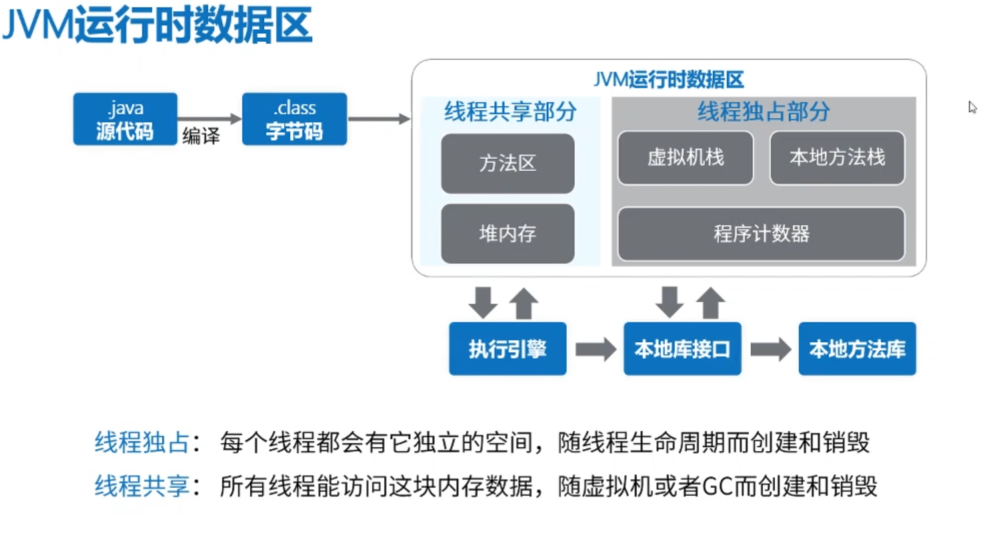

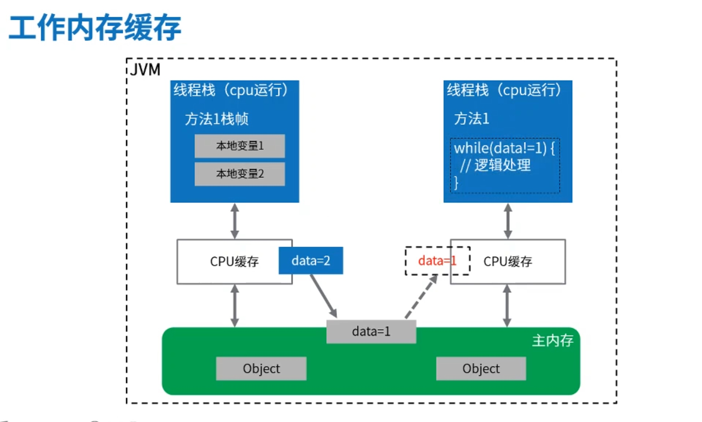

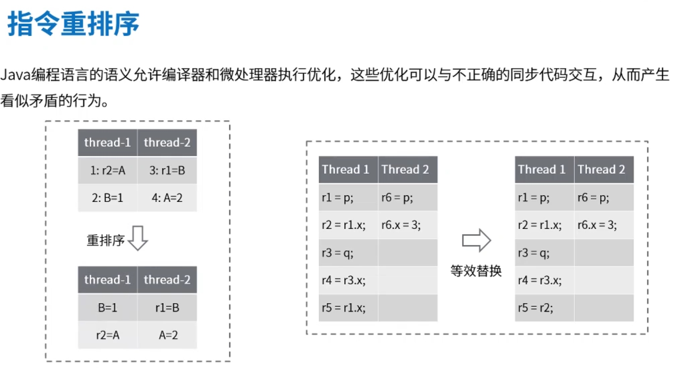

## 可见性
1. volatile 关键字的使用。
> 指令重排序导致的问题。
> JIT  just-in-time compiler 机制。
> 设置 vm-options ，编译器优化 关闭。
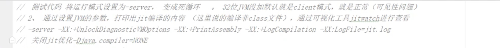

https://docs.oracle.com/javase/specs/jvms/se8/html/jvms-4.html

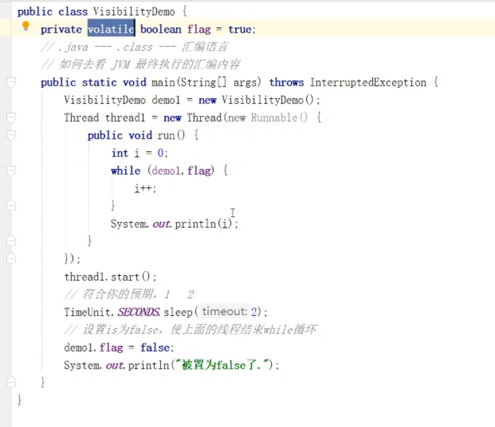

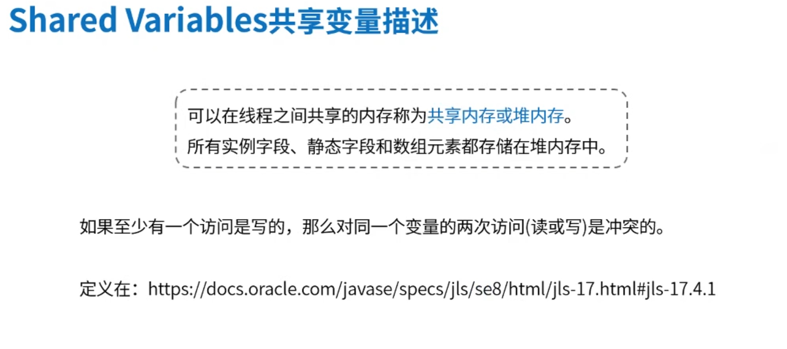

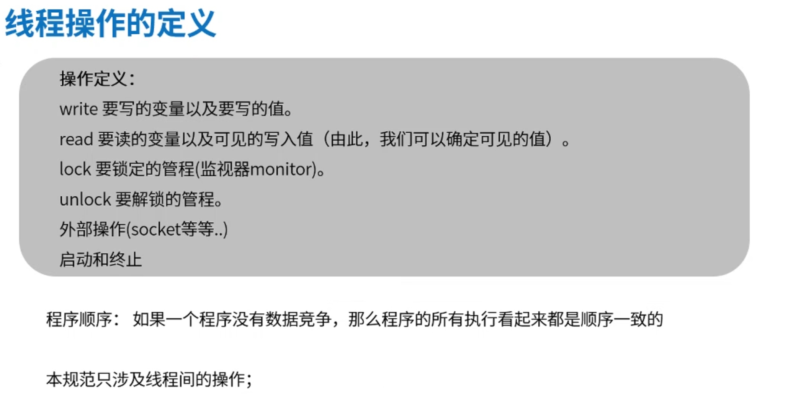

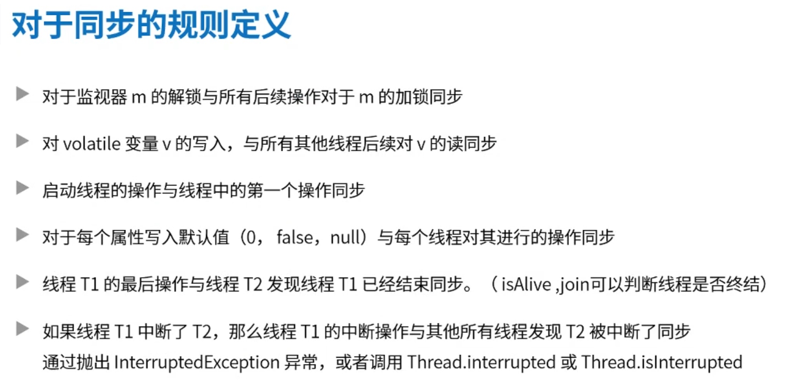

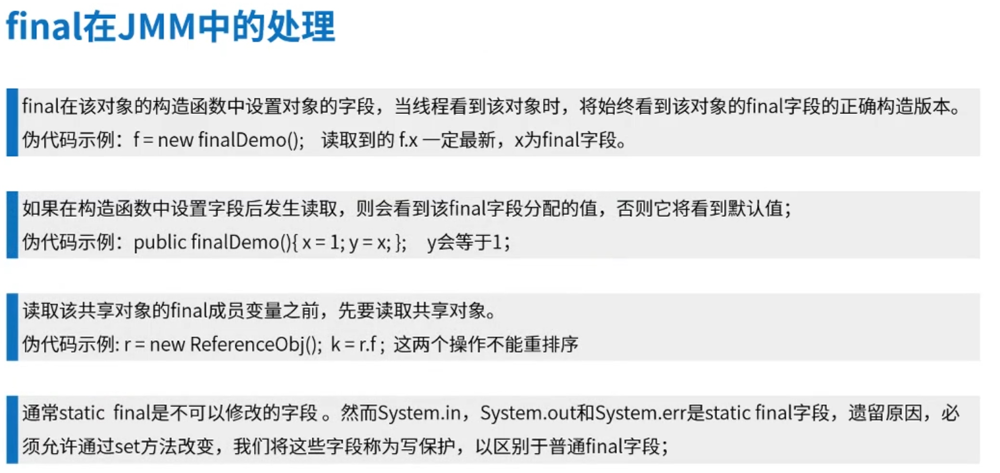

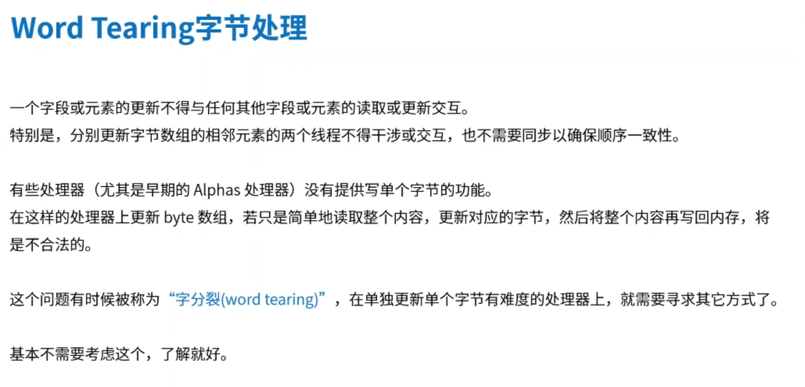

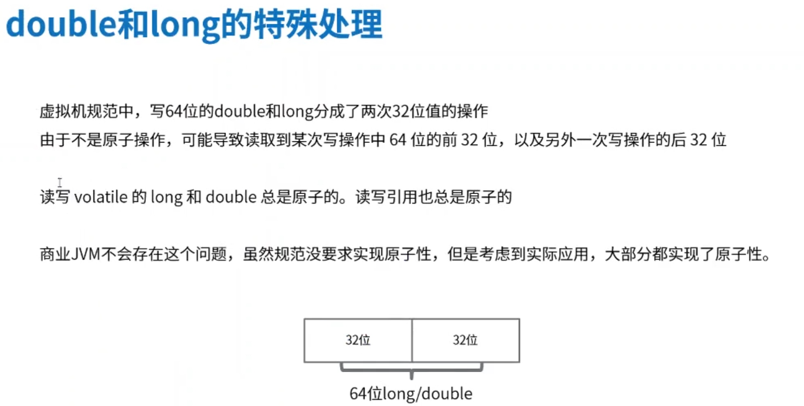

