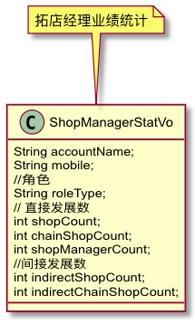
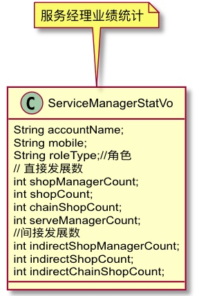
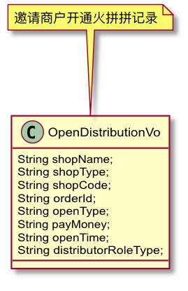
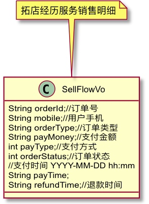

# 火拼拼分销二期

### 表信息
- 分销员与店铺绑定关系表
d_distributor_shop_rel

- 支付消息记录表
 ```sql
 -- 商户开通记录表
create table d_expand_shop_flow
(
    id                    bigint(20)               not null comment '主键' primary key,
    distributor_id        bigint(20)                 not null comment '拓店人员ID',
    distributor_role_type tinyint(4) not null comment '拓店人员角色类型',
    distributor_mobile    varchar(32) default '' not null comment '拓店人员手机号',
    entity_id             varchar(32) default ''              not null comment '商户id',
    entity_name           varchar(50) default ''             not null comment '商户名称',
    entity_type           tinyint(4)                not null comment '商户类型（连锁总部或者单店，后期可能支持连锁分店）',
    entity_code           varchar(50)                not null comment '店铺编码',
    invite_code           varchar(8)   default ''  not null  comment '邀请码',
    out_trade_no          varchar(32) default '' not null comment '外部支付流水号',
    order_id              varchar(32) default '' not null comment '开通订单号',
    open_type             tinyint(4)  default 0  not null comment '开通类型（首次开通0/续费1）',
    pay_fee               bigint(10)  default 0  null comment '支付金额',
    settle_status         tinyint(4) default 0 not null comment '分佣状态'
    create_time           bigint(20)                 not null,
    op_time               bigint(20)                 not null,
    last_ver              smallint(6) default 0 not null comment '版本号'
    is_valid              tinyint(1)  default 1  null comment '是否可用0:否,1:是'
) ENGINE=InnoDB DEFAULT CHARSET=utf8mb4 COMMENT='商户开通记录表'
-- 创建索引
create index idx_open_distribution_shop_id
    on d_open_distribution_shop_flow (id);
 
 ```

## 实体类

- 拓店经理业绩统计：

> 各个字段根据统计所得,已经存在统计逻辑。

- 服务经理业绩统计

> 各字段根据统计所得。已存在此逻辑

- 邀请商户开通记录


> 1. 通过新建 高级服务商城购买 消息体。
> 2. 商户信息： 通过消息体的 entityId 反查后插入。
> 3. 拓店人员信息：通过消息体的 邀请码 反查，后插入。
> 4. 开通类型 需要确认字段？？
> 5. 开通时间 `private BossPayDetailDTO payDetailDTO; createTime`
 
- 拓店经理销售明细


> 数据来源：d_contract_flow 表。
> 退款时间: 根据 订单状态去 op_time 更新的时间。
> 服务经理手机号：反查 对应的服务经理。**支持筛选，更改表字段**。
> 订单状态：contract_pay_staus
  ```
    TO_ACTIVATE((short)0, "待激活"),
    TO_PAY((short)1, "待支付"),
    PAY((short)2, "已支付"),
    REFUND((short)3, "已退款"),
    REFUND_FAIL((short)4, "退款失败"),
    PAY_FAIL((short)-1, "支付失败");
  ```
> 订单类型：contract_operate_type + after_role_type


- 佣金明细

| 名称 | 属性 | 来源 |
| --- | --- | --- |
| 用户手机号  | mobile | distributor_id |
| 佣金类型  |settleType | settle_type |
| 佣金金额  |settleMoney | settle_money |
| 状态 |settleStatus | settle_status |
| 产生时间 |createTime | create_time |
| 结算时间 |settleTime | op_time |
| 关联业务订单号|orderId | order_id |
| 关联业务订单号| settle_num | ?? |
> 数据源：d_wait_settle_flow
> 结算时间：根据 settle_status+op_time
> 产生时间：create_time
> 订单号：order_id
> 关联结算单号：？？

- 佣金结算记录

> 来源：d_settle_flow

| 名称 | 属性 | 来源 |是否支持查询|
| --- | --- | --- | --- |
| 用户手机号 | mobile | distributor_id  | 是 |
| 用户角色|roleType|distributor_role_type|是|
|结算金额|settleMoney|settle_money|是
|结算时间|settleTime|create_time|是
|结算单号|settleNum|id|是|


